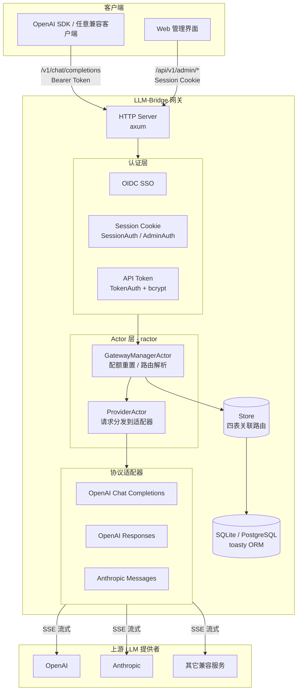
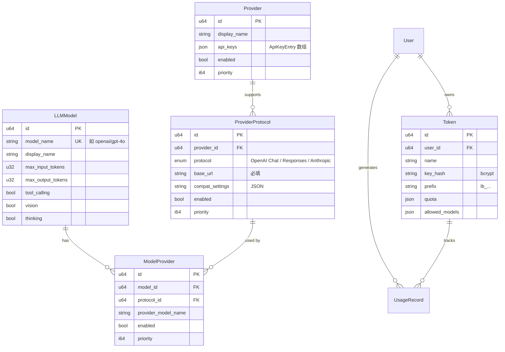

# LLM-Bridge

> 一个面向 **Homelab 与小型工作室** 的自托管 LLM 网关。
> 统一路由多个上游 LLM 提供者的 API 请求，兼容 OpenAI 客户端协议，
> 支持 OpenAI / Anthropic 等多种上游协议，内置 OIDC 登录、Token 配额、管理 UI。
>
> 🚧 **即将推出** VS Code Copilot 插件，可自动同步模型列表与参数，打通 IDE ↔ 网关的最后一公里。

[](./rust-toolchain.toml)
[](https://blog.rust-lang.org/2025/02/20/Rust-2024.html)
[](./LICENSE)

---

## 目录

- [为什么选择 LLM-Bridge](#为什么选择-llm-bridge)
- [简介](#简介)
- [核心特性](#核心特性)
- [系统架构](#系统架构)
- [技术栈](#技术栈)
- [快速开始](#快速开始)
- [配置](#配置)
- [数据模型](#数据模型)
- [API 参考](#api-参考)
- [前端管理界面](#前端管理界面)
- [支持的上游协议](#支持的上游协议)
- [项目结构](#项目结构)
- [开发指南](#开发指南)
- [示例](#示例)
- [可观测性](#可观测性)
- [VS Code Copilot 插件](#vs-code-copilot-插件规划中)
- [项目状态](#项目状态)

---

## 为什么选择 LLM-Bridge

如果你正在运行 Homelab 或管理一个小型工作室的 AI 工具，你很可能会遇到这些痛点：

> [!IMPORTANT]
> 😫 团队成员每人一个 ChatGPT/Claude 订阅，月底账单吓人一跳
> 😫 想用 GitHub Copilot，但模型列表需要手动编辑 JSON，换个模型就得改一次配置
> 😫 试过 LiteLLM 或 one-api，但 Python 依赖地狱、内存占用高、NAS 上跑不动
> 😫 API Key 散落在各个配置文件里，有人离职就得全部轮换一遍

**LLM-Bridge 就是为这些场景而生的。**

| 对比维度 | LLM-Bridge | LiteLLM | one-api | OpenRouter |
|:---------|:----------:|:-------:|:------:|:----------:|
| **定位** | 🏠 Homelab / 小型工作室 | 企业级网关 | 多租户中台 | 商业 SaaS |
| **运行时** | Rust 单二进制 ~15MB | Python + pip 依赖 | Go 二进制 ~30MB | SaaS 无需部署 |
| **内存占用** | 💚 空闲 ~15-25MB | 🟡 ~150-300MB | 🟢 ~40-80MB | — |
| **部署难度** | ⭐ 一条命令 | ⭐⭐⭐ Python 环境 | ⭐⭐ Docker Compose | — |
| **VS Code 集成** | 🚧 插件同步模型列表 | ❌ | ❌ | ❌ |
| **API Key 管理** | 多 Key 加权轮询 | 单 Key 轮询 | 多 Key 轮询 | 平台托管 |
| **OIDC 登录** | ✅ 内置 | ✅ 需配置 | ❌ | ❌（自有账号） |
| **配额管理** | ✅ 原生支持 | ❌ | ✅ 有限 | ✅ 需付费 |
| **单文件部署** | ✅ embed-frontend | ❌ | ❌ | — |

> 💡 **一句话总结**：LLM-Bridge 不是另一个大而全的企业网关。它是一块专为 Homelab 设计的"乐高积木"——轻得能在树莓派上跑，小得不需要 docker-compose，但功能刚好覆盖你管理全家/全工作室 LLM 访问所需的一切。

---

## 简介

LLM-Bridge 是一个用 Rust 编写的 **LLM 网关**，它的目标类似于一个自托管的 OpenRouter——但更轻、更小、更专注于 Homelab 场景。

**这个项目是怎么来的？** 在管理家庭和工作室的 AI 工具时，我发现现有方案要么太重（LiteLLM 要配 Python 环境），要么收费（OpenRouter 按 token 抽成），要么缺关键功能（one-api 没有 OIDC 和配额）。于是决定自己写一个——用 Rust 编译成单文件，丢到 NAS 上就能跑，内存占用不到一包薯片的份量。

**适用场景：**
- 🏠 **Homelab** — 在家里或 NAS 上跑一个轻量网关，统一管理你和家人朋友的 API Key，按配额分配使用
- 🎨 **小型工作室** — 团队成员通过统一入口访问多个 LLM，管理员集中管控成本与权限，无需每人单独申请各家 API Key
- 🔧 **VS Code / Copilot 用户** — 搭配即将推出的 VS Code 插件，编辑器内直接选择网关提供的模型，模型列表与参数自动同步

核心能力：

- 对客户端暴露**统一的 OpenAI 兼容接口**（`/v1/models`、`/v1/chat/completions`），现有任何 OpenAI SDK 客户端无需改动即可接入
- 在网关内部，将请求**路由到多个上游 LLM 提供者**（OpenAI、Anthropic、其它兼容服务），并支持按优先级回退
- 每个提供者可声明**多种协议端点**（如一个 Provider 既能走 `OpenAIChatCompletions` 又能走 `AnthropicMessages`），多组 API Key 跨协议共享并加权轮询
- 提供 **OIDC 单点登录、API Token、配额管理**与一套**可视化管理界面**，让你像运维一个内部 API 平台一样管理 LLM 访问

> 🌿 **资源占用**：空闲内存 ~15-25MB，满载也仅 ~60MB。单二进制约 15MB（不含前端）或 ~20MB（embed-frontend）。Rust 编译原生代码，无 GC 暂停，无运行时依赖。在树莓派 4（4GB）上也能流畅运行。

项目目前处于 `0.1.0` 版本，核心路径与管理界面已落地，正在持续完善测试与文档。

---

## 核心特性

### 🎯 统一入口

| 能力 | 说明 |
|------|------|
| **OpenAI 兼容 API** | `GET /v1/models`、`POST /v1/chat/completions`，流式 SSE + 非流式，透传 `reasoning_content` |
| **多协议上游适配** | 内置 OpenAI Chat / Responses、Anthropic Messages 三种适配器，支持自定义 base URL 与 headers |
| **多协议架构** | `ProviderProtocol` 表让一个 Provider 承载多个协议端点，路由解析走四表关联 |
| **优先级路由与回退** | LLMModel → ModelProvider → ProviderProtocol → Provider 四级解析，失败自动回退 |
| **加权 API Key 轮询** | 每个 Provider 持有多把 Key，按 `weight` 加权轮询，跨协议共享 |

### 🔐 多租户

| 能力 | 说明 |
|------|------|
| **OIDC 单点登录** | 任何兼容 OIDC 的 IdP（Keycloak、Authentik、Google…）均可作为登录后端 |
| **API Token 体系** | 用户可创建多个 `lb_` 前缀 Token，每 Token 独立配额与模型权限范围 |
| **配额管理** | daily / monthly / unlimited 三种周期，后台任务自动重置，防止账单失控 |
| **RBAC 管理 UI** | Svelte 5 单页应用：模型目录、Token 管理、Provider/协议管理、用户角色管理 |

### 🚀 性能与运维

| 能力 | 说明 |
|------|------|
| **极低资源占用** | 空闲 ~15-25MB 内存，单二进制 ~15MB，无 GC 暂停，树莓派 4 也能流畅运行 |
| **单二进制部署** | `embed-frontend` feature 把前端嵌入二进制，一条命令即可在 NAS、VPS 上运行 |
| **可观测性** | OpenTelemetry traces + logs → OTLP，每个 Actor 消息 `#[instrument]` 追踪 |
| **类型安全** | `ts-rs` + `axfetchum` 自动生成前端类型与 API 客户端，前后端零漂移 |
| **VS Code 插件** 🚧 | 即将推出的扩展，自动从网关同步模型列表与参数到编辑器 Copilot 配置 |

---

## 系统架构



---

## 技术栈

### 后端（Rust，Edition 2024 / Nightly）

| 类别 | 依赖 |
|------|------|
| Web 框架 | `axum` 0.8 |
| 异步运行时 | `tokio`（multi-thread） |
| Actor 框架 | `ractor` 0.15 |
| HTTP 客户端 | `reqwest` 0.13（rustls + stream） |
| 数据库 ORM | `toasty` 0.7（默认 SQLite，可选 PostgreSQL） |
| 时间 | `jiff` 0.2 |
| 认证 | `openidconnect` 4.0、`tower-sessions` 0.15、`bcrypt` 0.19 |
| 可观测性 | `opentelemetry` 0.32、`tracing`、`tracing-subscriber` |
| 类型生成 | `ts-rs` 12、`axfetchum` 0.1 |
| 序列化 | `serde` / `serde_json` |
| 错误处理 | `thiserror` 2.0 |

### 前端（TypeScript）

| 类别 | 依赖 |
|------|------|
| 框架 | Svelte 5（runes） |
| 构建 | Vite 8 |
| 样式 | TailwindCSS 4 + bits-ui + tailwind-variants |
| 路由 | svelte-spa-router 5 |
| 状态 | @tanstack/svelte-store |
| 包管理 | pnpm |

---

## 快速开始

### 前置要求

- **Rust nightly**（项目附带 `rust-toolchain.toml`，首次进入目录会自动安装）
- **pnpm**（用于前端开发）
- 任意一个 **OIDC 兼容的 IdP**（如 Keycloak、Authentik、Google、GitHub Apps 等）—— 可选，但缺失则只能用 API Token 调用 `/v1/*`，无法登录管理界面

### 1. 克隆并构建后端

```bash
git clone <repo-url> llm-bridge
cd llm-bridge

# 调试构建
cargo build

# 发布构建
cargo build --release
```

### 2. 启动前端开发服务器（可选，开发模式）

```bash
cd frontend
pnpm install
pnpm run dev
# → http://127.0.0.1:5173
```

### 3. 启动网关

```bash
# 最简启动（无 OIDC，仅 API Token 可用）
cargo run

# 带 OIDC 与前端嵌入的单二进制启动
cargo build --release --features embed-frontend
LLM_BRIDGE_OIDC_ISSUER_URL=https://idp.example.com \
LLM_BRIDGE_OIDC_CLIENT_ID=llm-bridge \
LLM_BRIDGE_OIDC_CLIENT_SECRET=... \
./target/release/llm-bridge
```

默认监听 `http://127.0.0.1:3000`。生产部署时加上 `--features embed-frontend,otel` 可获得单二进制 + OpenTelemetry 的完整版本。

---

## 配置

所有配置通过环境变量传递，无额外配置文件。

### 通用配置

| 变量 | 默认值 | 说明 |
|------|--------|------|
| `LLM_BRIDGE_GATEWAY_ID` | `llm-bridge-v1` | 网关标识，用于日志追踪 |
| `LLM_BRIDGE_HOST` | `127.0.0.1` | 监听地址 |
| `LLM_BRIDGE_PORT` | `3000` | 监听端口 |
| `LLM_BRIDGE_STORE_PATH` | `./data/llm-bridge` | SQLite 数据库存储目录 |
| `RUST_LOG` | `info` | 日志级别（`tracing-subscriber` env-filter） |

### OIDC 配置

仅当 `LLM_BRIDGE_OIDC_ISSUER_URL` 设置时启用 OIDC 登录；否则管理界面不可用，只能通过 API Token 调用 `/v1/*`。

| 变量 | 默认值 | 说明 |
|------|--------|------|
| `LLM_BRIDGE_OIDC_ISSUER_URL` | 无（禁用 OIDC） | IdP 的 Issuer URL |
| `LLM_BRIDGE_OIDC_CLIENT_ID` | 空 | OIDC Client ID |
| `LLM_BRIDGE_OIDC_CLIENT_SECRET` | 空 | OIDC Client Secret |
| `LLM_BRIDGE_OIDC_SCOPES` | `openid profile email` | 申请的 scopes |
| `LLM_BRIDGE_BASE_URL` | `http://localhost:3000` | 网关自身对外可访问的 base URL（用于 OIDC 回调） |

> 首个通过 OIDC 登录的用户会自动获得 `Admin` 角色，后续用户为 `Member`。

### Cargo Features

| Feature | 说明 |
|---------|------|
| `embed-frontend` | 启用 `rust-embed`，把 `frontend/dist` 嵌入后端二进制，适合单文件部署 |
| `otel` | 启用 OpenTelemetry traces + logs → OTLP HTTP 导出 |
| `postgresql` | 切换 `toasty` 后端为 PostgreSQL（默认 SQLite） |

---

## 数据模型

LLM-Bridge 采用 **OpenRouter 风格** 的数据模型，共 7 张核心表：



**路由解析流程**：

```
resolve_model(model_name)
  → LLMModel（按 model_name 查询）
  → ModelProvider[]（按 model_id，enabled 过滤，priority 排序）
      → ProviderProtocol（按 protocol_id）→ base_url / compatibility
      → Provider（按 provider_id）→ api_keys（KeySelector 加权轮询）
  → 构建 ResolvedProviderRoute 列表，按 priority fallback
```

---

## API 参考

### OpenAI 兼容接口（客户端使用）

需要 `Authorization: Bearer <api_token>` 头部，Token 通过管理界面创建（`lb_` 前缀）。

| 端点 | 方法 | 说明 |
|------|------|------|
| `/v1/models` | GET | 返回所有可用模型（含能力、定价、各提供者信息） |
| `/v1/chat/completions` | POST | 聊天补全，支持 `stream: true`（SSE） |

请求与响应格式完全兼容 OpenAI Chat Completions API，支持 `user` / `assistant` 角色、`reasoning_content` 透传与工具调用。

### Auth API

| 端点 | 方法 | 说明 |
|------|------|------|
| `/auth/login` | GET | 触发 OIDC 跳转 |
| `/auth/callback` | GET | OIDC 回调，建立 Session |
| `/auth/me` | GET | 返回当前登录用户信息 |
| `/auth/logout` | GET | 销毁 Session |

### Token 管理 API

| 端点 | 方法 | 认证 | 说明 |
|------|------|------|------|
| `/api/v1/tokens` | GET | Session | 列出当前用户的 Token |
| `/api/v1/tokens` | POST | Session | 创建 Token（明文仅返回一次） |
| `/api/v1/tokens/{id}` | PATCH / DELETE | Session | 更新 / 删除 Token |

### Admin API

所有 Admin 端点需 Session + `UserRole::Admin`。

| 端点 | 方法 | 说明 |
|------|------|------|
| `/api/v1/models` | GET | 列出全部模型 |
| `/api/v1/models/available` | GET | 仅列出已绑定启用提供者的模型 |
| `/api/v1/admin/providers` | GET / POST | 列出 / 创建 Provider |
| `/api/v1/admin/providers/{id}` | GET / PUT / DELETE | Provider 单条 CRUD |
| `/api/v1/admin/providers/{id}/models` | GET / POST | Provider 下的模型关联 |
| `/api/v1/admin/providers/{id}/models/{mid}` | PUT / DELETE | 更新 / 删除关联 |
| `/api/v1/admin/providers/{id}/protocols` | GET / PUT | 查看 / 全量替换提供者协议列表 |
| `/api/v1/admin/users` | GET | 列出所有用户 |
| `/api/v1/admin/users/{id}/role` | PATCH | 修改用户角色 |

> 完整的字段格式请参考 [`docs/admin-api.md`](./docs/admin-api.md)。

---

## 前端管理界面

Svelte 5 单页应用，位于 `frontend/`，开发模式监听 `http://127.0.0.1:5173`，生产模式可嵌入后端二进制。

| 页面 | 路由 | 权限 | 功能 |
|------|------|------|------|
| 登录 | `/login` | 无 | 触发 OIDC 跳转 |
| 模型目录 | `/` `/models` | Session | 模型表格，支持搜索、排序、全部/可用筛选 |
| API Token | `/tokens` | Session | 当前用户 Token 的 CRUD |
| 提供者管理 | `/providers` | Admin | 卡片列表，含 Provider、Protocol、ModelProvider 关联管理 |
| 用户管理 | `/users` | Admin | 用户列表 + 角色修改 |

侧边栏按 RBAC 分组：菜单区（模型目录、API Token）所有用户可见；管理区（提供者、模型、用户）仅 Admin 可见。未认证访问受保护路由会自动跳转到 `/login`。

---

## 支持的上游协议

| 协议 | 上游示例 | 特性 |
|------|---------|------|
| `OpenAiChatCompletions` | OpenAI `/v1/chat/completions` | 流式 SSE、自定义 base URL、自定义 headers |
| `OpenAiResponses` | OpenAI `/v1/responses` | 流式 SSE、Responses API 格式 |
| `AnthropicMessages` | Anthropic `/v1/messages` | 流式 SSE、Thinking 内容、工具调用 |

每个适配器均支持：自定义 base URL + path suffix、自定义 HTTP headers（`compat_settings`）、错误消息提取与转发、Thinking/Reasoning 内容传输、工具调用结果传递。

新增协议只需在 `ProviderCompatibility` 枚举中追加变体并在 `src/actors/provider/adapters/` 下实现一个新适配器模块。

---

## 项目结构

```
llm-bridge/
├── Cargo.toml                  # 依赖与 features 定义
├── rust-toolchain.toml         # 锁定 nightly + clippy + rustfmt
├── PLAN.md                     # 多协议架构重设计计划
├── STATUS.md                   # 项目现状与进度报告
├── docs/                       # 架构与 API 文档
├── examples/                   # 命令行端到端示例
│   ├── openai_stream_cli.rs
│   └── anthropic_stream_cli.rs
├── frontend/                   # Svelte 5 管理界面
│   └── src/
│       ├── lib/                # 页面组件
│       └── bindings/           # ts-rs / axfetchum 自动生成的 TS 类型与客户端
└── src/
    ├── main.rs                 # 入口：可观测性 → 配置 → HTTP 服务
    ├── lib.rs
    ├── types.rs                # 通用 LM 类型（消息、角色、响应、工具调用）
    ├── config/                 # RuntimeSettings、ProviderCompatibility 枚举
    ├── db/                     # toasty ORM：7 张核心表定义与初始化
    ├── auth/                   # OIDC / Session / Token / Quota 服务
    ├── middleware/             # SessionAuth / AdminAuth / TokenAuth 提取器
    ├── store/                  # Store 层：CRUD、四表路由解析、KeySelector
    ├── actors/                 # ractor Actor：GatewayManager、Provider + 适配器
    ├── server/                 # axum 路由：openai_api / admin / auth / tokens
    └── observability/          # OpenTelemetry 初始化
```

---

## 开发指南

### 后端

```bash
# 编译检查
cargo check

# Lint（项目要求 clippy 零警告）
cargo clippy --all-targets

# 运行测试
cargo test

# 运行示例（端到端连通性测试）
cargo run --example openai_stream_cli -- <url> <api_key> <model>
```

### 前端

```bash
cd frontend
pnpm install
pnpm run dev       # 开发服务器
pnpm run build     # 生产构建到 frontend/dist
pnpm run check     # svelte-check 类型检查
```

### 同步 TypeScript 绑定

后端类型变更后，需要重新生成前端的 TypeScript 绑定（位于 `frontend/src/bindings/`）：

```bash
# 生成 ts-rs 类型文件（.ts）
cargo test export_bindings

# 生成 axfetchum API 客户端（client.ts）
cargo test generate_ts_client
```

> `ts-rs` 负责数据类型文件，`axfetchum` 负责根据后端路由声明生成 API 客户端。两者双通道保持前后端类型一致。

### 单二进制部署

```bash
# 先构建前端
cd frontend && pnpm run build && cd ..

# 再构建带嵌入前端的二进制
cargo build --release --features embed-frontend

# 部署只需一个可执行文件 + SQLite 数据目录
./target/release/llm-bridge
```

---

## 示例

项目附带两个命令行示例，用于快速验证上游连通性：

```bash
# OpenAI 兼容服务
cargo run --example openai_stream_cli -- https://api.openai.com/v1 sk-xxx gpt-4o-mini

# Anthropic
cargo run --example anthropic_stream_cli -- https://api.anthropic.com sk-xxx claude-3-5-sonnet-latest
```

示例会先输出 `[THINK]`（若上游返回推理内容），再输出 `[TEXT]` 文本流。

---

## 可观测性

启用 `otel` feature 后，LLM-Bridge 会向 OTLP HTTP endpoint 导出 traces 与 logs：

```bash
cargo build --features otel
# 默认导出到 http://localhost:4318（标准 OTLP HTTP 端口）
```

- 每个 Actor 消息处理均带有 `#[instrument]` span
- `tracing-subscriber` 集成，支持 `RUST_LOG` env-filter
- GatewayManager 与 ProviderActor 的请求生命周期完整可追踪

---

## VS Code Copilot 插件（规划中）🚧

LLM-Bridge 将提供一款 VS Code 扩展，打通 **编辑器 ↔ 网关** 的最后一公里：

```
┌──────────────────┐      自动同步模型列表      ┌──────────────────┐
│  VS Code         │ ◄──────────────────────► │  LLM-Bridge      │
│  + 插件          │    /v1/models +          │  网关            │
│                  │    参数配置               │                  │
└──────────────────┘                          └──────────────────┘
```

**核心能力（规划）：**

| 功能 | 说明 |
|------|------|
| **模型列表自动同步** | 插件定期拉取网关 `/v1/models`，自动填充 VS Code Copilot 的可用模型清单，无需手动编辑 JSON 配置 |
| **参数一键同步** | 网关中配置的 `max_tokens`、`temperature` 等参数可直接同步到编辑器，或在插件 UI 中按模型微调 |
| **多网关切换** | 支持配置多个 LLM-Bridge 实例，一键切换（如家庭网关 ↔ 工作室网关） |
| **Token 管理集成** | 在编辑器内直接查看 Token 用量、配额剩余，无需打开管理页面 |

> 插件将以 VS Code Extension 形式发布，兼容 VS Code Stable 与 Insiders，并计划支持 Cursor / Windsurf 等兼容编辑器。具体发布时间请关注本仓库 Release。

---

## 项目状态

LLM-Bridge 当前处于 `0.1.0`，核心路径与管理界面均已落地：

- ✅ OpenAI 兼容 API（流式 + 非流式）
- ✅ 三种协议适配器（OpenAI Chat / Responses / Anthropic）
- ✅ 多协议 ProviderProtocol 架构
- ✅ OIDC 登录 + Session + API Token 三通道认证
- ✅ 配额管理（daily / monthly / unlimited + 后台重置）
- ✅ Admin REST API（Provider / 协议 / 模型 / 用户）
- ✅ Svelte 5 管理界面（5 个页面）
- ✅ OpenTelemetry 可观测性
- � VS Code Copilot 插件（规划中）
- �🔄 测试套件与文档完善中

详细进度与已知问题见 [`STATUS.md`](./STATUS.md)，架构演进计划见 [`PLAN.md`](./PLAN.md)。

---

## License

本项目基于 [BSD 3-Clause License](./LICENSE) 开源 — © 2026 monetx。

- ✅ **可商用** — 允许商业使用与闭源衍生品。
- ✅ **可修改与再分发** — 但必须保留上述版权声明与许可文本。
- ✅ **强制署名** — 再分发源码或二进制时必须保留 `Copyright (c) 2026, monetx` 的版权声明。
- 🚫 **禁止冒名背书** — 未经 monetx 书面许可,不得使用其名义为衍生产品背书或推广。

完整条款见 [`LICENSE`](./LICENSE)。衍生项目建议在明显位置标注
"Based on LLM-Bridge by monetx, licensed under BSD-3-Clause" 以满足署名要求。
